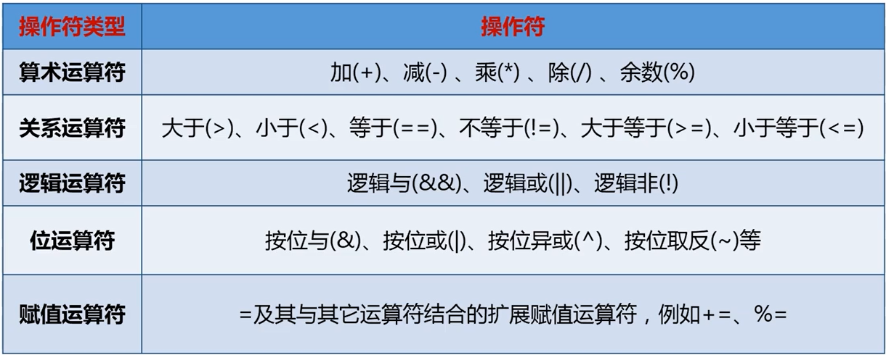
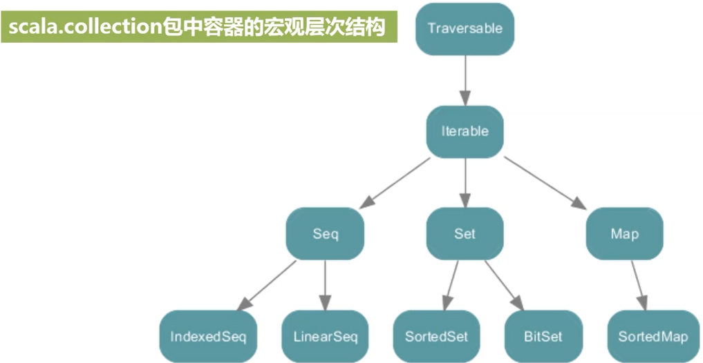
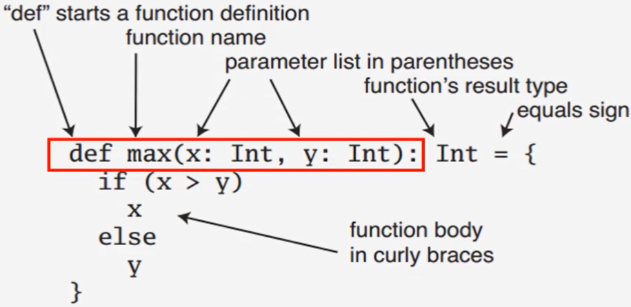

# 基本数据类型

## 数据类型

| 数据类型 | 描述                                                         |
| :------- | :----------------------------------------------------------- |
| Byte     | 8位有符号补码整数。数值区间为 -128 到 127                    |
| Short    | 16位有符号补码整数。数值区间为 -32768 到 32767               |
| Int      | 32位有符号补码整数。数值区间为 -2147483648 到 2147483647     |
| Long     | 64位有符号补码整数。数值区间为 -9223372036854775808 到 9223372036854775807 |
| Float    | 32 位, IEEE 754 标准的单精度浮点数                           |
| Double   | 64 位 IEEE 754 标准的双精度浮点数                            |
| Char     | 16位无符号Unicode字符, 区间值为 U+0000 到 U+FFFF             |
| String   | 字符序列                                                     |
| Boolean  | true或false                                                  |
| Unit     | 表示无值，和其他语言中void等同。用作不返回任何结果的方法的结果类型。Unit只有一个实例值，写成()。 |
| Null     | null 或空引用                                                |
| Nothing  | Nothing类型在Scala的类层级的最底端；它是任何其他类型的子类型。 |
| Any      | Any是所有其他类的超类                                        |
| AnyRef   | AnyRef类是Scala里所有引用类(reference class)的基类           |

注：

- 基本的数据类型在scala中是以一种类的形式实现的。
- string类型的实现是完全从java.lang.String中照搬过来。

## 基础字面量

### 整型字面量

型字面量用于 Int 类型，如果表示 Long，可以在数字后面添加 L 或者小写 l 作为后缀。

```scala
0
035
21 
0xFFFFFFFF 
0777L
```

### 浮点型字面量

如果浮点数后面有f或者F后缀时，表示这是一个Float类型，否则就是一个Double类型的。

```scala
0.0 
1e30f 
3.14159f 
1.0e100
.1
```

### 布尔型字面量

布尔型字面量有 true 和 false。

### 符号字面量

符号字面量被写成： **<标识符>** ，这里 **<标识符>** 可以是任何字母或数字的标识（注意：不能以数字开头）。

```scala
package scala
final case class Symbol private (name: String) {
   override def toString: String = "'" + name
}
```

### 字符字面量

在 Scala 字符变量使用单引号 **'** 来定义

```scala
'a' 
'\u0041'
'\n'
'\t'
```

### 字符串字面量

在 Scala 字符串字面量使用双引号 **"** 来定义

```scala
"Hello,\nWorld!"
```

### 多行字符串

多行字符串用三个双引号来表示分隔符，格式为：`""" ... """`

```scala
val foo = """
www.runoob.com
www.w3cschool.cc
www.runnoob.com
以上三个地址都能访问"""
```

# 操作符



优先级：算术运算符>关系运算符>逻辑运算符>赋值运算符

注：

- 操作符定义成方法：a 方法 b     <==> a.方法(b)
- 富包装类：比如，int的富包装类是RichInt

# 变量

不可变：函数式编程

可变：面向对象编程

| val  | 不可变 | 声明时必须初始化 | 不能再赋值 |
| ---- | ------ | ---------------- | ---------- |
| var  | 可变的 | 声明时需要初始化 | 可以再赋值 |

规范格式

```scala
Val 变量名[：数据类型]=初始值

Var 变量名[：数据类型]=初始值
```

类型推断机制——var

# 输入输出

## 控制台输入输出语句

### 从控制台读入数据的方法

(scala.io.StdIn)

| readInt    | readShort | readChar    |
| ---------- | --------- | ----------- |
| readDouble | readFloat | readBoolean |
| readByte   | readLong  | readLine    |

### 控制台打印数据

Print、println、printf

- 这些实现在scala.Predef中，这个包默认情况下被所有Scala程序引用，当scala启动时自动引用。

**插值字符串**

- s"…$变量名…"：s插值字符串
- f"…$变量名%格式化字符串…"：f插值字符串——控制字符串中变量输出的格式

## 读写文件

### 写文件包

```scala
import java.io.PrintWriter
val outputFile = new PrintWriter("test.txt")
outputFile.println("Hello World")
outputFile.print("Spark is good")
outputFIle.close()
```

### 读取文件

```scala
import scala.io.Source
val inputFile = Source.fromFile("output.txt")
val lines = inputFile.getlines // 返回的结果是一个迭代器
For (line <- lines) println(line)
```

#  控制结构

## If条件表达式

```scala
if(表达式){
  语句块1
}
else{
  语句块2
}
注：
```

- if表达式可以用来赋值：

```scala
 val a = if (x>0) 1 else -1
```

## while循环

```scala
while(表达式){
  循环体
}
do{
  循环体
}while(表达式)
```

##  for循环

### 基础用法

`for(变量<-Range) {语句块}`

- **Range** 可以是一个数字区间表示 **i to j** ，或者 **i until j**； 
  - **i to j** 包含j
  - **i until j** 不包含j

```scala
for(i < -1 to 5 by 2) println(i) // 1 to 5 by 2 是一个生成器，类似python的range()用法
for(i <- 1 to 5; j <- 1 to 3) println(i*j) // 在 for 循环中可以使用分号 (;) 来设置多个区间，它将迭代给定区间所有的可能值。
```

### for循环集合

`for( var x <- List ) {表达式}`

```scala
object Test {
   def main(args: Array[String]) {
      var a = 0;
      val numList = List(1,2,3,4,5,6);

      // for 循环
      for( a <- numList ){
         println( "Value of a: " + a );
      }
   }
}
output:
value of a: 1
value of a: 2
value of a: 3
value of a: 4
value of a: 5
value of a: 6
```

### for循环过滤

守卫表达式：`for(变量 <- 表达式 if 条件表达式) 语句块`

```scala
for(i <- 1 to 5 if i%2==0) println(i)
```

### for使用yield

`for推导式：for(变量 <- 表达式) yield {语句块}`

```scala
var r = for(i <- Array(1, 2, 3, 4, 5) if i%2==0) yield{println{i}; i}
```

## 异常处理

受检异常

写代码时，编程人员必须清楚知道代码可能会抛出哪些错误及相关处理的方法。

不受检异常

代码的运行过程中抛出错误。

- 优点：代码简洁
- 缺点：代码中的错误在运行时被抛出来，没有定义好解决方式

scala把所有异常定义为不受检异常

```scala
Try {
  语句块
}catch{
  case ex: FileNotFountException =>
    // 文件不存在时的操作
  case ex: IOException =>
    // 文件I/O错误时的操作
}finally{
  语句块
}
```

## 对循环的控制

breaks类（包scala.util.control）

```scala
import util.control.Breaks._ // 导入Breaks类的所有方法
val array = Array(1, 3, 10, 5, 4)
breakable{
  for(i <- array){
    if (i > 5) break // 跳出breakable，终止循环
    println(i)
  }
}// 上面的for循环输出1，3
```

# 数据结构

## 数组（Array）

### 一维数组

Scala 语言中提供的数组是用来存储**固定大小**的**同类型**元素。

```scala
// 数组声明
val intValueArr: Array[String] = new Array[Int](3) // 声明一个长度为3的整形数组，每个数组元素初始化为0,
val intValueArr = new Array(3) // 省略类型声明也是允许的

// 数组元素赋值
intValueArr(0) = 12
intValueArr(1) = 45
intValueArr(2) = 33
for(i <- 0 to 2) println(myStrArr(i)) // 通过数值索引数组元素
for ( x <- myList ) println( x ) // 输出所有数组元素
```

### 多维数组 

```scala
scala> import Array._
scala> val array = Array.ofDim[Int](2,3)
array: Array[Array[Int]] = Array(Array(0, 0, 0), Array(0, 0, 0))
```

注：Array来自java

## 元组（Tuple）

对多个不同类型对象的一种简单封装，可返回不同类型的对象

```scala
val tuple = ("BigData", 2015, 45.0)
Println(tuple._1)
Println(tuple._2)
Println(tuple._3)
```

## 容器（Collection）

容器类的三个包：scala.collection, scala.collection.mutable, scala.collection.immutable



##  列表（List）

 

## 集合（Set）

“哈希”方法构成集合，分为可变集合和不可变集合。

 

## 映射（Map）

键唯一，但值不唯一。

 

## 迭代器（Iterable）

# 面向对象编程

## 类的定义

```scala
class 类名{
  // 这里定义类的字段和方法
  def 方法名(参数列表): 返回结果类型 = {方法体} // 方法定义格式一
  def 方法名(参数列表) {方法体}         // 方法定义格式二
  def 方法名: 返回结果类型 = {方法体}      // 方法定义格式三
  def 方法名: 返回结果类型 = 一句代码      // 方法定义格式四
  def value  // 相当于java的getter()方法，读取类中变量
  def value_ // 相当于java的setter()方法，修改类中变量
}
```

(1) 方法的参数列表中的参数不能用val和var进行修饰。

(2) 参数列表也可以是大括号

(3) 方法体部分如只有一条指令，则省去方法体的大括号也可以。

(4) 成员的可见性

- private，protected
- scala默认如果没有加任何修饰关键字，默认类为公开类

**举例**

```scala
Class Counter{
  private var privateValue = 0
  def value = privateValue
  def value_=(newValue: Int){
    if(newValue > 0) privateValue = newValue
  }
  def increment(step: Int): Unit = {value += step}
  def increment(step: Int) {value += step}
  def current: Int = value
  def getValue(): Int = value
}
```

 

```scala
val myCounter = new Counter
myCounter.value_=(3) // 为privateValue设置新的值
println(myCounter.value) // 打印输出3
myCounter increment 5 // 中缀调用法
myCounter.getValue() // getValue定义中有括号，可以带括号调用
myCounter.getValue // getValue定义中有括号，也可不带括号调用
myCounter.current // current定义中没有括号，只能不带括号调用
 
```

## 构造器

**举例**

```
class Counter(var name: String)
var myCounter = new Counter("Runner")
Println(myCounter.name)
myCounter.name_=("Timer") // 调用写方法
myCounter.name = "Timer"  // 更直观地调用写方法，和上一句等效
```

这里的var表示name为Counter的一个成员变量

**举例**

```
Class Counter{
  private var value = 0
  private var name = ""
  Private var step = 1
  println("the main constructor")
  
  def this(name: String){ // 第一个辅助构造器
    this() // 调用主构造器
    this.name = name
    printf("the first auxiliary constructor, name: %s\n", name)
  }
  def this(name: String, step: Int){ // 第二个辅助构造器
    this(name) // 调用前一个辅助构造器
    this.step = step
    printf("the second auxiliary constructor, name: %s, step: %d\n", name, step)
  }
  
  def increment(step: Int): Unit = {value += step}
  
  def current(): Int = {value}
}
 
val c1 = new Counter // 调用主构造器
val c2 = new Counter("the 2nd Counter") // 调用第一个辅助构造器
val c3 = new Counter("the 3rd Counter", 2)  // 调用第二个辅助构造器
 
```

## 对象

### 单例对象

```
Object Person{
  private var lastId = 0 // 一个人的身份编码
  def newPersonId() = {
    lastId += 1
    lastId
  }
}
单例对象可以直接调用类中的方法
printf("The first person id: %d.\n", Person.newPersonId()) 
// 输出“The first person id：1”
printf("The second person id: %d.\n", Person.newPersonId())
// 输出“The first person id：2”
printf("The third person id: %d.\n", Person.newPersonId())
// 输出“The first person id：3”
```

#### 伴生对象

定义在同一个文件中的，单例对象和同名类可以互相访问对方内部的成员

**举例**

```scala
(同一个代码文件)
class Person(val name: String){
  private val id = Person.newPersonId() // 调用了伴生对象中的方法
  def info(){
    printf("The id of %s is %d.\n", name, id)
  }
}
object Person{
  privte var lastId = 0 // 一个人的身份编号
  def newPersonId()={
    lastId += 1
    lastId
  }
}
```

#### 孤立对象


### 提取器(Extractor)

#### apply方法

用括号传递给类实例或单例对象名一个或多个参数时，scala会在相应的类或对象中查找方法名为apply且参数列表与传入的参数一致的方法，并用传入的参数调用该apply方法。（工厂方法，无需new）

注：apply方法需要自行在类的定义中实现。

作用：保持对象和函数的一致性

- 面向对象：对象.方法
- 函数式：函数名称（参数）

**举例**

```scala
class Car(name: String){
  def info(){
    println("Car name is" + name)
  }
}
object Car{
  def apply(name: String) = new Car(name) // 调用伴生类Car的构造方法
}
object MyTestApply{
  def main(args: Array[String]){
    val mycar = Car("BMW) // 调用伴生对象中的apply方法
    mycar.info() // 输出结果为“car name is BMW”
  }
}
```

#### unapply方法

apply的反向操作（提取对象特定字段的值）

**举例**

```scala
class Car(val brand: String, val price: Int){
  def info(){
    println("Car brand is " + brand + " and price is " + price)
  }
}
object Car{
  def apply(brand: String, price: Int)={
    println("Debug:calling apply …")
    new Car(brand, price)
  }
  // option类型：有值，返回some对象；无值，返回None对象。
  def unapply(c: Car): Option[(String, Int)]={
    println("Debug: calling unapply …")
    some((c.brand, c.price))
  }
}
object TestUnapply{
  def main(args: Array[String]){
    var Car(carbrand, carprice) = Car("BMW", 800000)
    println("brand: " + carbrand + "and carprice: " + carprice)
  }
}
 
```

### update方法

当对带有括号并包括一到若干参数的对象进行赋值时，编译器将调用对象的update方法，并将括号里的参数和等号右边的值一起作为update方法的输入参数来执行调用。

举例

```scala
val myStrArr = new Array[String](3) // 声明一个长度为3的字符串数组，每个数组元素初始化为null
myStrArr(0) = "BigData" // 实际上，调用了伴生类Array中的update方法，执行myStrArr.update(0, "BigData”)
```


## 继承

### 抽象类

抽象类：没有实现的类，用关键字abstract修饰

- 定义抽象类需要用关键字abstract修饰
- 定义抽象类的抽象方法不需要使用关键字abstract
- 抽象字段就是没给初值的抽象类中定义的字段。

**举例**

```
Abstract class Car(val name: String){
  val carBrand: String // 字段没有初始化值，就是一个抽象字段
  def info() // 抽象方法
  def greeting(){
    println("Welcome to my car!")
  }
}
```

### 扩展类

- 继承关键字：extends
- 重载父类的抽象成员，关键字override是可选的；如果重载父类的非抽象成员，关键字override是必须的；如果重载父类的抽象成员，关键字override不是必须的。
- 只能重载val类型字段，不能重载var类型字段

**举例**

```scala
abstract class Car(val name: String){
  val carBrand: String // 字段没有初始化值，就是一个抽象字段
  def info() // 抽象方法
  def greeting(){
    println("Welcome to my car!")
  }
}
class BMWCar extends Car{
  override val carBrand = "BMW"
  info(){printf("This is a %s car. It is expensive.\n", carBrand)}
  override def greeting(){println("Welcome to my BMW car!")}
}
class BYDCar extends Car{
  override val carBrand = "BYD"
  info(){printf("This is a %s car. It is cheap.\n", carBrand)}
  override def greeting(){println("Welcome to my BYD car!")}
}
object MyCar {
  def main(args: Array[String]){
    val myCar1 = new BMWCar()
    val myCar2 = new BYDCar()
    myCar1.greeting()
  }
}
```

### option类

**举例**

```
case class Book(val name: String, val price: Double) // 对于case class，系统会总动封装实现apply方法。 
val books = Map("hadoop" -> Book("Hadoop", 35.5), "spark" -> Book("Spark", 55.5), "hbase" -> Book("HBase", 26.0)) // 定义一个书名到书对象的映射
books.get("hadoop") // 返回该键所对应值得Some对象
books.get("hive") // 不存在该键，返回None对象
Books.get("hadoop").get // Some对象的get方法返回其包装的对象Book("Hadoop", 35.5)
Books.get("hive").get // None对象的get方法会抛出异常
…
Books.get("hive").getOrElse("Unknown name", 0) // 返回book("Unknown name", 0.0)
 
```

## Trait

特征类似java的接口，但是其不仅能在其中定义抽象方法，还能提供具体方法的实现。

在scala中，一个类可以继承一个超类，但是能混入（mixin）多个特质。

特质使用关键字trait修饰。

特质还可以集成其他特质。

举例

```scala
trait Flyable{
  var maxFlyHeight: Int // 抽象字段
  def fly() // 抽象方法
  def breathe(){
    println("I can breathe")
  }
}
Class Bird(flyHeight: Int) extends Flyable{
  var maxFlyHeight: Int = flyHeight // 重载特质的抽象字段
  def fly(){
    printf("I can fly at the height of %d.", maxFlyHeight)
  }
}
val b = new Bird(100) 
// I can fly at the height of 100
b.breathe() 
// I can breathe
举例
trait Flyable{
  var maxFlyHeight: Int // 抽象字段
  def fly() // 抽象方法
  def breathe(){
    println("I can breathe")
  }
}
trait HasLegs{
  val legs: Int
  def move(){printf("I can walk with %d legs", legs)}
}
class Animal(val category: String){
  def info(){printfln("This is a " + category)}
}
Class Bird(flyHeight: Int) extends Animals("Bird") with Flyable with HasLegs{
  var maxFlyHeight: Int = flyHeight // 重载特质的抽象字段
  val legs = 2 //重载特质的抽象字段
  def fly(){
    printf('I can fly at the height of %d, maxFlyHeight)  
  } // 重载特质的抽象法fa
}
val bird = new Bird(108)
b.info 
// This is a
b.fly 
// I can fly at the height of 108
b.move 
// I can walk with 2 legs
 
```

## 模式匹配

### match语句

可以匹配Char、Int等其他类型

**举例****1**

```scala
import scala.io.StdIn._
println("Please input the score:")
val grade = readChar()
grade match{
  case 'A' => println("85-100")
  case 'B' => println("70-84")
  case 'C' => println("60-69")
  case 'D' => println("<60")
  case _ => println("error input!") // 相当于"switch…case…"中的default
}
```

**举例****2**

```scala
import scala.io.StdIn._
println("Please input a country:")
val country = readLine()
country match{
  case "China" => println("中国")
  case "America" => println("美国")
  case "Japan" => println("日本")
  case _ => println("我不认识！")
}
```

**举例****3**

```scala
for(elem <- List(6, 9, 0.618, "Spark", "Hadoop", "Hello")){
  val str = elem match{
    case i: Int => i + "is an int value." // 匹配整型的值，并赋值给i
    case d: Double => d+ "is a double value." // 匹配浮点型的值
    case "Spark" => "Spark is found." // 匹配特定的字符串
        case s: String => s + "is a string value." // 匹配其它字符串
    case _ => "unexpected value: " + elem // 与以上都不匹配
  }
  println(str)
}
举例4
for(elem <- List(1, 2, 3, 4)){
  elem match{
    case _ if(elem % 2 == 0) => println(elem + "is even.")
    case _ => println(elem + "is odd.")
  }
}
```

### case class

经过优化的用于模式匹配的类。

case class是一个非常特殊自动定义伴生对象，通过定义伴生对象定义一个工厂方法，不需要new。

**举例**

```scala
case class Car(brand: String, price: Int)
val myBYDCar = Car("BYD", 89000)
val myBMWCar = Car("BWM", 1200000)
val myBenzCar = Car("Benz", 1500000)
for(car <- List(myBYDCar, myBMWCar, myBenzCar)){
  car match{
    case Car("BYD", 89000) => println("Hello, BYD!")
    case Car("BMW", 1200000) => println("Hello, BWM!")
    case Car(brand, price) => println("Brand:" + brand + ", Price:" + price + ", do you want it?")
  }
}
 
```

## 包

**举例**

```scala
package xmu{
  package autodepartment{
    class ControlCourse{
      …
    }
  }
  package csdepartment{
    class OSCourse{
      val cc = new autodepartment.ControlCourse
    }
  }
}
 
import xmu.autodepartment.ControlCourse
class MyClass{
  var myos = new ControlCourse
}
```

# 函数式编程基础

## 函数定义与使用

### 方法定义



### 函数定义

```scala
val counter: Int => Int = {(value) => value += 1}
```

### 函数和方法的区别

Scala 有方法与函数，二者在语义上的区别很小。Scala 方法是类的一部分，而函数是一个对象可以赋值给一个变量。换句话来说在类中定义的函数即是方法。Scala 中的方法跟 Java 的类似，方法是组成类的一部分。

Scala 中的函数则是一个完整的对象，Scala 中的函数其实就是继承了 Trait 的类的对象。

Scala 中使用 **val** 语句可以定义函数，**def** 语句定义方法。

用法区别：

1. 函数可作为一个参数传入到方法中，而方法不行。

2. 在Scala中无法直接操作方法，如果要操作方法，必须先将其转换成函数。
   有两种方法可以将方法转换成函数：

   ```scala
   val f1 = m _
   ```

   在方法名称m后面紧跟一个空格和下划线告诉编译器将方法m转换成函数，而不是要调用这个方法。 也可以显示地告诉编译器需要将方法转换成函数：

   ```scala
   val f1: (Int) => Int = m
   ```

3. 函数必须要有参数列表，而方法可以没有参数列表

4. 在函数出现的地方我们可以提供一个方法

小结：

- **方法是一个以def开头的带有参数列表（可以无参数列表）的一个逻辑操作块，这正如object或者class中的成员方法一样。**
- **函数是一个赋值给一个变量（或者常量）的匿名方法（带或者不带参数列表），并且通过=>转换符号跟上逻辑代码块的一个表达式。=>转换符号后面的逻辑代码块的写法与方法的body部分相同。**

### 匿名函数（Lambda表达式）

`(参数) => 表达式`

- 如果参数只有一个，参数的圆括号可以省略

**举例**

```scala
(num: Int) => num * 2
val myNumFunc: Int => Int = (num: Int) => num*2
val myNumFunc = (num: Int) => num*2 // 省略函数的参数类型，scala可以自动推断类型，等同上一语句
val myNumFunc: Int => Int = (num) => num*2 // 省略匿名函数的参数类型，scala可以自动推断类型，等同上一语句
```

### 偏函数（PartialFunction）

`case` 关键字可用于创建 `PartialFunction` 类型的函数字面值（匿名函数）：

```scala
val xs = List(1, 2, 3, 4)

xs.filter {
  case n ⇒ n % 2 == 0
}
```

事实上，`case` 关键字是 **最常用** 的创建 `PartialFunction` 的方式，若不用 `case`，则只能手动创建 `PartialFunction` 实例：

```scala
val fraction = new PartialFunction[Int, Int] {
  def apply(d: Int) = 42 / d
  def isDefinedAt(d: Int) = d != 0
}
```

使用 `case` 明显更加紧凑：

```scala
val fraction: PartialFunction[Int, Int] = {
  case d: Int if d != 0 ⇒ 42 / d
}
```

注意，必须手动指定 `fraction` 的类型为 `PartialFunction`，否则 Scala 编译器会报错：

```scala
val fraction = {
  case d: Int if d != 0 ⇒ 42 / d
}
```

也可以将 `fraction` 类型指定为普通函数，但这样就失去了偏函数的魔力：

```scala
val fraction: Function[Int, Int] = {
  case d: Int if d != 0 ⇒ 42 / d
}
```

### 下划线“_”

```scala
// 下划线代表字面量一次出现，不能出现第二次。
举例
Val counter = (_: Int) + 1 // 有类型时括号不能省略，等效于“x: Int => x+1”
Val add = (_: Int) + (_: Int) // 等效于“(a: Int, b: Int) => a+b”
Val m1 = List(1, 2, 3)
Val m2 = m1.map(_*2) // map接受一个函数作为参数，相当于“m1.map(x=>x*2)”
```

### 闭包

闭包是一个函数，返回值依赖于声明在函数外部的一个或多个变量。

闭包通常来讲可以简单的认为是可以访问一个函数里面局部变量的另外一个函数。

```scala
var factor = 3  
val multiplier = (i:Int) => i * factor  // 引入一个自由变量 factor，这个变量定义在函数外面。这样定义的函数变量 multiplier 成为一个"闭包"，因为它引用到函数外面定义的变量，定义这个函数的过程是将这个自由变量捕获而构成一个封闭的函数。
```

## 高阶函数

高阶函数：函数参数仍然是函数。

**举例**

```scala
def powerOfTwo(x: Int): Int = {if(x==0) 1 else 2*powerOfTwo(x-1)}
def sumInts(a: Int, b: Int): Int = {if(a>b) 0 else a+sumInts(a+1, b)}
def sumSquares(a: Int, b: Int): Int = {if(a>b) 0 else a*a+sumSquares(a+1, b)}
def sumPowersOfTwo(a: Int, b: Int): Int = {
  if (a>b) 
    0 
  else 
    sumPowersOfTwo(a)+sumPowersOfTwo(a+1, b)
}
def sum(f: Int => Int, a:Int, b: Int)={
  if(a>b) 0 else f(a) + sum(f, a+1, b)
}
```

##  针对容器的操作

### 容器的标准遍历方法foreach

**举例一**

```
val list = List(1, 2, 3)
val f = (i: Int) => println(i) // 将一个lambda表达式赋值给变量f，发是函数类型的变量
list.foreach(f)
```

**举例二**

```
val university = Map("XMU"->"Xiaomen University", "THU"->"Tsinghua University", "PKU"-> "Peking University")
University foreach{kv => println(kv._1 + ":" + kv._2)}  // 中缀表示法
University foreach{x => x match{case(k, v) => println(k + ":" + v)}}
University foreach{case(k, v) => println(k + ":" + v)}
```

### 映射操作

#### map方法

**举例**

```
val books = List("Hadoop", "Hive", "HDFS")
books.map(s => s.toUpperCase) // toUpperCase方法将一个字符串中的每个字母都变成大写字母
books.map(s => s.length) // 将字符串映射到它的长度
```

#### flatMap方法

**举例**

```
books flatMap(s => s.toList)
// List[char] = List(H, a, d, o, o, p, H, i, v, e, H, D, F, S)
```

#### 过滤操作

**举例**

```
val university = Map("XMU"->"Xiamen University", "THU"->"Tsinghua University", "PKU"-> "Peking University", "XMUT" -> "XiaMen University of Technology")
val xmus = university filter {kv => kv._2 contains "Xiamen"}
val l = List(1, 2, 3, 4, 5, 6) filter {_%2==0} // 使用了占位符语法，过滤能被2整除的元素
```

#### 归约操作

**举例**

```
val list = List(1, 2, 3, 4, 5)
list.reduce(_+_) // 将列表元素累加，使用了占位符语法
// 15
list.reduce(_*_) // 将列表元素连乘
// 120
list map(_.toString) reduce((x, y) => s"f($x, $y)")
list reduceLeft {_-_} // 从左到右规约
// -13
list reduceRight {_-_} // 从右到左规约
// 3
List.fold(10)(_*_) // fold:初始值为10的规约
// 1200
(list fold 10)(_*_) // fold的中缀调用写法
(list foldLeft 10)(_-_) // 计算顺序（((((10-1)-2)-3)-4)-5）
(list foldRight 10)(_-_)  // 计算顺序 (((((10-5)-4)-3)-2)-1)
```

 

## 函数式编程实例WordCount